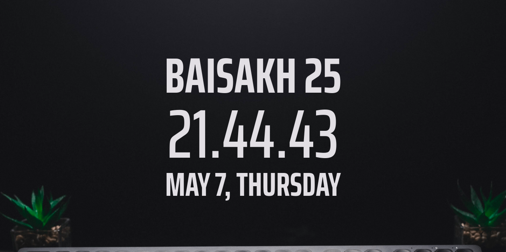

 

A chrome/firefox extension to show distraction free nepali date on your new tab.

 

## Web Version:

[See on heroku](https://whatsthemiti.herokuapp.com/)

## Firefox Installation:

[Link to the extension](https://addons.mozilla.org/en-US/firefox/addon/undistracted-me/)

## Chrome Installation:

[Link to the extension](https://chrome.google.com/webstore/detail/undistracted-me/dfgbijakkhepoonhaelocdmcleeehmef/)

## Offline Installation:

1. First **Clone or Download** this repository.
2. After successfull download, unzip it with your archive manager.
3. Open extensions page using [chrome://extensions](chrome://extensions)
4. Now enable **Developer mode** located on your right side of navigation bar.
5. Click on **Load Unpacked** and select your unzipped folder.

If everything goes right, you could see undistracted me working seamlessly on your chrome and its variants.

## TODOS:

1.  [x] Publish on Firefox
2.  [x] Publish on Chrome
3.  [ ] Add Todos Functionality
4.  [ ] Integrate Weather Functionality

## FEATURES REQUESTS

1. [ ] Speed dial links like in r/startpages by u/nepmandu
2. [ ] Dewanagiri support by u/pranphy
3. [ ] Toggle between 12/24 hours by u/deeplydark
