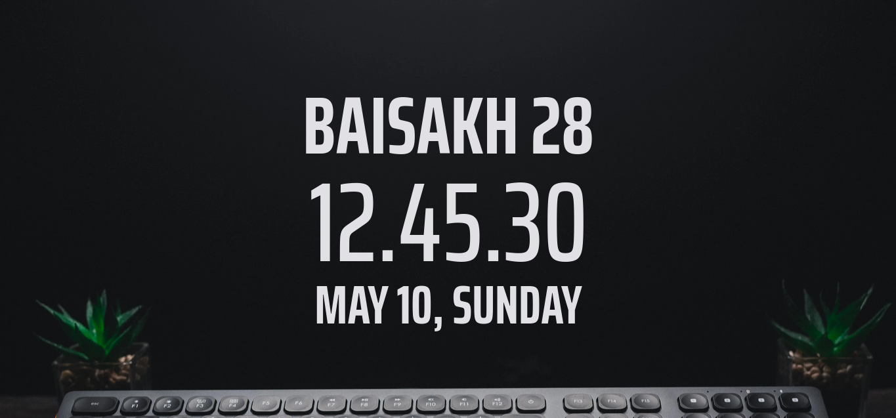

<p align="center">
<br>
<strong>
A chrome/firefox extension that replaces your new tab with a beautiful, distraction-free dashboard featuring nepaliness, focus mode, google integrations and more.
</strong><br>

<span>
<a href="http://hits.dwyl.com/sarojbelbase/undistracted-me"></a>
<a href="https://chromewebstore.google.com/detail/undistracted-me/dfgbijakkhepoonhaelocdmcleeehmef"></a>
<a href="https://addons.mozilla.org/en-US/firefox/addon/undistracted-me/"></a>
 <a href="https://github.com/sidbelbase/undistracted-me/releases"></a>
<a href="https://chromewebstore.google.com/detail/undistracted-me/dfgbijakkhepoonhaelocdmcleeehmef">
</a>
</span>

</p>



## Deployments

- [Chrome Web Store](https://chromewebstore.google.com/detail/undistracted-me/dfgbijakkhepoonhaelocdmcleeehmef)
- [Firefox Addons](https://addons.mozilla.org/en-US/firefox/addon/undistracted-me/)
- [Official Website](https://undistractedme.sarojbelbase.com.np/)

## Tech Stack

- **React 19** + **Vite v8** + **@crxjs/vite-plugin** (Manifest V3)
- **Tailwind CSS v4** for styling
- **Zustand** for state management
- **Bun** as package manager and runtime

## Google OAuth Scopes

The app requests the following Google OAuth scopes when you connect your Google account:

| Scope | Purpose |
|---|---|
| `userinfo.profile` | Display your name and avatar in the Settings panel |
| `userinfo.email` | Display your email in the Settings panel |
| `calendar.readonly` | Sync and display upcoming events from Google Calendar in the Upcoming Events widget |
| `contacts.readonly` | Read birthdays and anniversaries from Google Contacts for the Occasions widget |
| `drive.metadata.readonly` | Search your Google Drive files by name directly from the Focus Mode search bar |
| `tasks` | Add, complete, and manage Google Tasks from the Tasks panel in Focus Mode |

## Build Setup

```bash
# install dependencies
bun install

# start dev server
bun run dev

# build for production (outputs to dist/)
bun run build
```

### Chrome

```bash
# build and zip for Chrome Web Store
bun run build:chrome
```

This outputs a `chrome.zip` inside the `builds/` folder, ready to upload to the Chrome Web Store.

**Load unpacked for local testing:**

1. Run `bun run build`
2. Open `chrome://extensions`
3. Enable **Developer mode**
4. Click **Load unpacked** and select the `dist/` folder

### Firefox

```bash
# build for Firefox Addons
bun run build:firefox

# run locally with web-ext
bun run start:firefox
```

This outputs a `.zip` inside the `builds/` folder via `web-ext`, ready to upload to Firefox Addons.

## Testing

```bash
# E2E tests (Playwright)
bun run test

# Unit tests (Vitest)
bun run test:unit

# Unit tests with coverage
bun run test:unit:coverage
```

## License

MIT

#### Made with React in Nepal.
